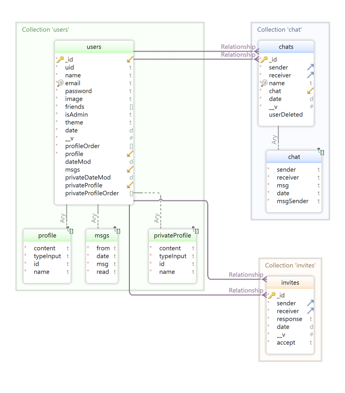

# Social Connect: Back

Este es un servidor creado con NodeJS y Express, y gestiona el tráfico de información del front de la aplicación, a través de endpoints y también de una librería **socket.io**, que permite comunicaciones directas instantáneas.

---
## **Tecnologías utilizadas:**
- bcryptjs: "^2.4.3",
- cloudinary: "^1.36.2",
- cors: "^2.8.5",
- dotenv: "^16.0.3",
- express: "^4.18.2",
- express-validator: "^7.0.1",
- firebase-admin: "^11.8.0",
- jsonwebtoken: "^9.0.0",
- moongose: "^1.0.0",
- multer: "^1.4.5-lts.1",
- socket.io: "^4.6.1"

---
## Iniciar el Servidor:
Se debe ejecutar el comando **npm install** para instalar las dependencias y luego **npm run dev**.

---
## EndPoints:

Cuenta con 3 rutas para los diferentes endpoints:
* Pública: se pueden obtener los perfiles públicos de los usuarios: **/api/public**
* Usuario: engloba la mayoría de operaciones, gestiona todos los datos del usario, así también como los chats, invitaciones, amigos, etc... **/api/users/**
* Socket: gestiona las onexiones directas con los clientes, principalmente para el chat, pero también para enviar algunas órdenes específicas, como por ejemplo: recargar los perfiles, o las invitaciones, o los amigos de un usuario, etc... **/api/socket**

*Todas las especificaciones de la API se pueden consultar en la [aquí](https://pablopace-dev.github.io/SocialConnect_Back/).

---
## Base de Datos:
* Se utiliza MongoDB por su flexibilidad a la hora de gestionar la información de los perfiles del usuario, ya que éste tiene la libertad de almacenar la cantidad de elementos que quiera, es decir que *no* hay una base predefinida, por lo que un modelo *NoSQL* se ajusta mejor a la resolución de esta situación.

---
## .env:
PORT= el puerto donde se va a ejecutar el servidor
URI_CONNECT= la URI de conexión a la base de datos de Mongo

// Los datos de configuración de Cloudinary
CLOUDINARY_URL

CLOUDINARY_NAME
CLOUDINARY_KEY
CLOUDINARY_API_SECRET

URL_BACK= URL del servidor

// Los datos de conexión de Firebase Admin
FB_TYPE
FB_PROJECT_ID
FB_PRIVATE_ID
FB_PRIVATE_KEY2
FB_PRIVATE_KEY
CLIENT_EMAIL
CLIENT_ID
AUTH_URI
TOKEN_URI
AUTH_PROVIDER_CERT_URL
CLIENT_CERT_URL

*Todos estos datos se pasarán en un archivo adjunto.